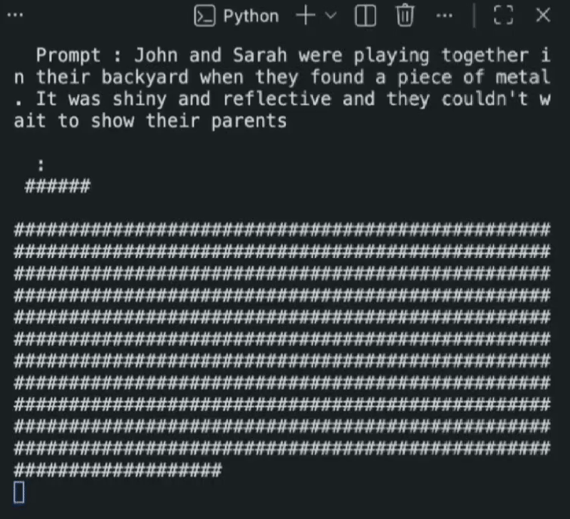
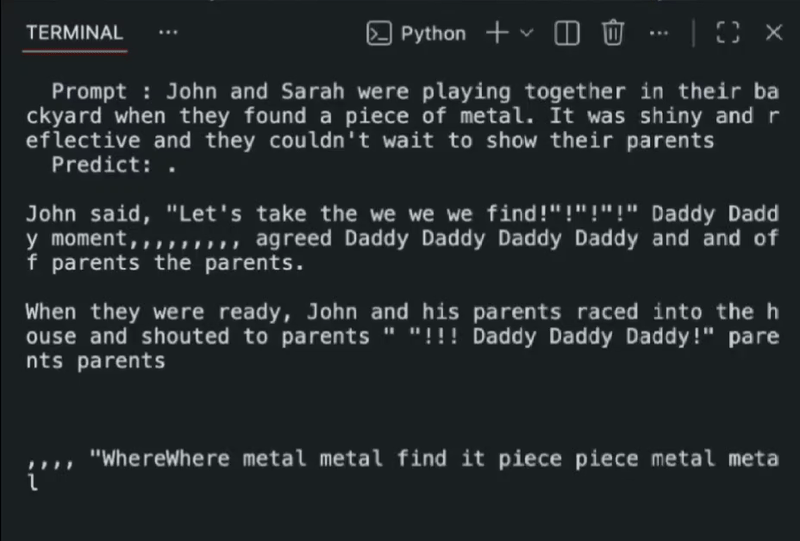

# LLaDA Demo

**English** | [中文](#中文说明)

A demo project for LLaDA — a diffusion language model based on a Transformer encoder that generates text through iterative **de-masking**.

<div align="center">
  <table>
    <tr>
      <td align="center"><b>Decoding (gradual de-masking)</b></td>
      <td align="center"><b>Correction</b>: show raw predictions at each step to observe how the model revises its output</td>
    </tr>
    <tr>
      <td></td>
      <td></td>
    </tr>
  </table>
</div>

> **Note**: The current model is trained only on a small dataset with 128-token sequences and **does not have strong reasoning ability**. This project is intended for **algorithm reproduction and inference flow demonstration** of the LLaDA diffusion language model.

## Quick Start

A pre-trained model checkpoint (`checkpoints/final_model.pth`) is included in this repository. You can run the demo immediately after installing dependencies — no training required.

### 1. Install dependencies

```bash
pip install torch transformers datasets tokenizers tqdm
```

### 2. Run the demo

```bash
python demo.py
```

This loads the pre-trained model and generates text with an animated de-masking visualization. You can switch between `"decoding"` (gradual reveal) and `"correction"` (watch the model revise its predictions) display modes in `demo.py`.

## Pre-trained Model

| | |
|---|---|
| **Checkpoint** | `checkpoints/final_model.pth` |
| **Parameters** | 8,311,808 (~8.3M, all trainable) |
| **Architecture** | Bidirectional Transformer encoder |
| **Dataset** | [TinyStories](https://huggingface.co/datasets/roneneldan/TinyStories) (10,000 samples) |

### Architecture

| Parameter | Value |
|-----------|-------|
| d_model | 256 |
| n_layers | 4 |
| n_heads | 4 |
| d_ff | 1024 |
| max_seq_len | 128 |
| vocab_size | 10,000 |

All hyperparameters are defined in [config.py](config.py). See [model.py](model.py) for the full model implementation.

> **Why so many epochs?** Diffusion models must learn to denoise at every noise level (from nearly fully masked to almost clean), which is inherently harder than autoregressive next-token prediction. In this mini project, the combination of a small model (8.3M) and limited data (10K samples) means each epoch provides relatively little signal — hence a large number of epochs is needed for convergence.

## Project Structure

```
├── model.py          # LLaDA model definition (Transformer encoder)
├── inference.py      # Inference algorithms (random / low-confidence remasking)
├── train.py          # Training script (diffusion loss)
├── demo.py           # Run the demo
├── config.py         # Hyperparameters
├── helper.py         # Utilities (model loading, device detection)
├── my_tokenizer/     # Custom tokenizer (vocab 10,000)
├── assets/           # README demo images (GIF)
└── checkpoints/      # Model weights
```

## Reference

- [Large Language Diffusion Models (arXiv)](https://arxiv.org/abs/2502.09992) — the original LLaDA paper

---

<a id="中文说明"></a>

# LLaDA Demo

LLaDA 的推理演示项目——基于 Transformer 编码器的扩散语言模型，通过**去掩码**的方式生成文本。

> **注意**：当前模型仅在小数据集上完成了 128 token 长度的训练，**不具备较强的推理能力**。本项目目前用于 LLaDA 扩散语言模型的**算法复现与推理流程演示**。

## 快速开始

本项目已包含预训练模型权重（`checkpoints/final_model.pth`）。安装依赖后即可直接运行 demo，无需额外训练。

### 1. 安装依赖

```bash
pip install torch transformers datasets tokenizers tqdm
```

### 2. 运行 demo

```bash
python demo.py
```

加载预训练模型，生成文本并展示去掩码动画。可在 `demo.py` 中切换 `"decoding"`（逐步显现）和 `"correction"`（观察模型修正预测）两种显示模式。

## 预训练模型

| | |
|---|---|
| **权重文件** | `checkpoints/final_model.pth` |
| **参数量** | 8,311,808（约 8.3M，全部可训练） |
| **架构** | 双向 Transformer 编码器 |
| **数据集** | [TinyStories](https://huggingface.co/datasets/roneneldan/TinyStories)（10,000 条样本） |

### 模型架构

| 参数 | 值 |
|------|-----|
| d_model | 256 |
| n_layers | 4 |
| n_heads | 4 |
| d_ff | 1024 |
| max_seq_len | 128 |
| vocab_size | 10,000 |

所有超参数定义在 [config.py](config.py) 中，模型实现详见 [model.py](model.py)。

> **为什么需要大量 epoch？** 扩散模型需要在所有噪声水平（从几乎全掩码到几乎无掩码）上学习去噪，任务难度远超自回归式预测下一个 token。在这个 mini project 中，模型小（8.3M）、数据集少（10K），每轮训练提供的有效信号有限，因此需要大量 epoch 才能收敛。

## 项目结构

```
├── model.py          # LLaDA 模型定义（Transformer encoder）
├── inference.py      # 推理算法（random / low-confidence remasking）
├── train.py          # 训练脚本（扩散损失）
├── demo.py           # 运行 demo
├── config.py         # 超参数
├── helper.py         # 工具函数（加载模型、设备检测）
├── my_tokenizer/     # 自定义 tokenizer（vocab 10,000）
├── assets/           # README 演示图片（GIF）
└── checkpoints/      # 模型权重
```

## 参考

- [Large Language Diffusion Models (arXiv)](https://arxiv.org/abs/2502.09992) — LLaDA 原论文
